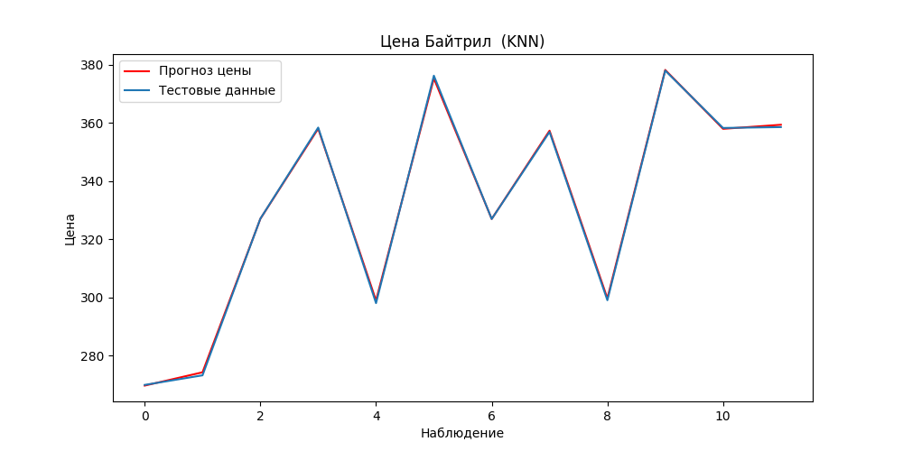
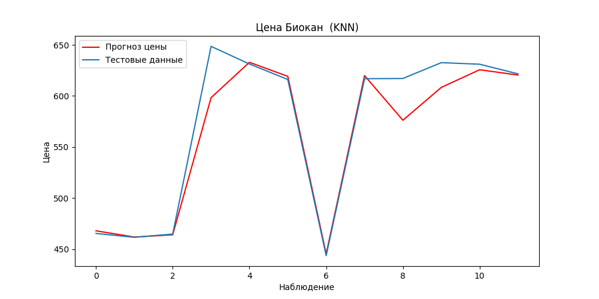
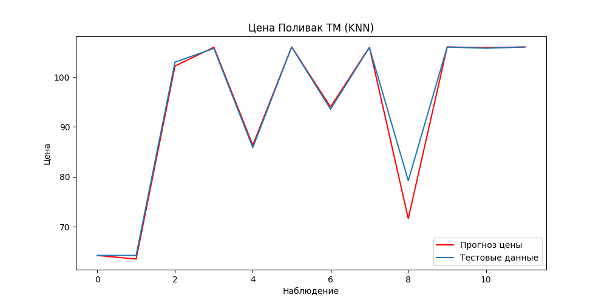
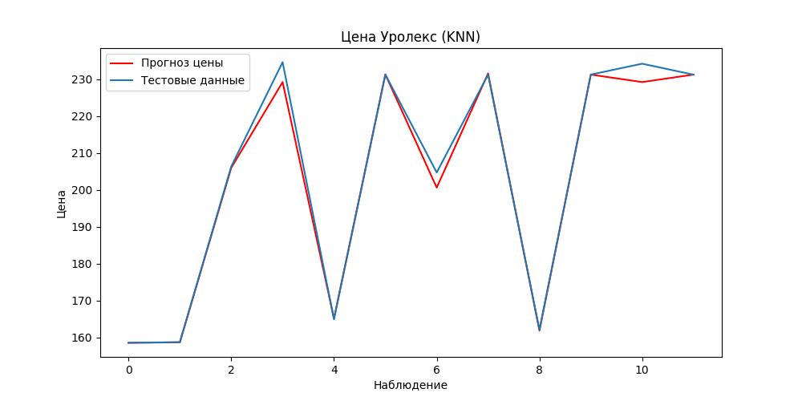
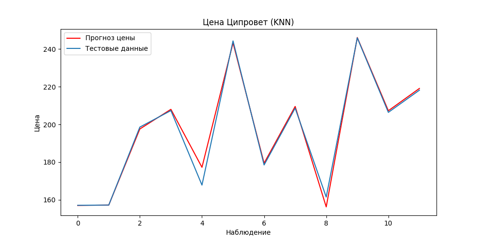

# 1-5Crystal Line
## Цена
RMSE| Коэффициент детерминации | MAE
-|-|-
4.218958216788934 | 0.9497133276847407 | 2.608232107449434

## Количество
RMSE | Коэффициент детерминации | MAE
-|-|-
0.8160457534147963 | 0.960724246039073 | 0.738759857414188

# Азинокс 
## Цена
RMSE| Коэффициент детерминации | MAE
-|-|-
4.460001483181115 | 0.9574141728605412 | 1.6671040132749606

## Количество
RMSE | Коэффициент детерминации | MAE
-|-|-
0.24592851522354725 | 0.9907506849042699 | 0.22787097122401076

# Альбен
## Цена
RMSE| Коэффициент детерминации | MAE
-|-|-
4.112978417850385 | 0.9959873501095529 | 2.520449640292403

## Количество
RMSE | Коэффициент детерминации | MAE
-|-|-
0.45135638733682043 | 0.9796681100588605 | 0.34419638009253956

# Амоксициллин 1
## Цена
RMSE| Коэффициент детерминации | MAE
-|-|-
4.362811988146272 | 0.9977357580819732 | 3.428099801813628

## Количество
RMSE | Коэффициент детерминации | MAE
-|-|-
0.33784379148877275 | 0.9623756356616191 | 0.31588771884936523

# Анандин 
## Цена
RMSE| Коэффициент детерминации | MAE
-|-|-
3.112835922205394 | 0.9870796645960717 | 1.5338188938945738

## Количество
RMSE | Коэффициент детерминации | MAE
-|-|-
0.5064826163692236 | 0.9739606539623736 | 0.45454896874048306

# Байтрил 
## Цена
RMSE| Коэффициент детерминации | MAE
-|-|-
0.6102141905110204 | 0.9997271654535467 | 0.5042350718334774

## Количество
RMSE | Коэффициент детерминации | MAE
-|-|-
0.12123324240313695 | 0.9926565117490918 | 0.10361424358296602

# Биовак DPAL (1 доза)
## Цена
RMSE| Коэффициент детерминации | MAE
-|-|-
6.251569328044264 | 0.9961293742949228 | 3.277527084061615

## Количество
RMSE | Коэффициент детерминации | MAE
-|-|-
0.42886710182924254 | 0.9986218972837906 | 0.3276513290134884

# Биокан 
## Цена
RMSE| Коэффициент детерминации | MAE
-|-|-
20.093736836696763 | 0.9366369672103325 | 11.239444181467258

## Количество
RMSE | Коэффициент детерминации | MAE
-|-|-
0.17401368103986034 | 0.9960944494005126 | 0.15903448205659051

# Веракол 
## Цена
RMSE| Коэффициент детерминации | MAE
-|-|-
7.819428538509912 | 0.9884325028831582 | 4.065891403932156

## Количество
RMSE | Коэффициент детерминации | MAE
-|-|-
0.14680788910853174 | 0.9968393835153635 | 0.12894986371800085

# Витам 
## Цена
RMSE| Коэффициент детерминации | MAE
-|-|-
1.3818043392269566 | 0.9787018131029034 | 0.5981711906371269

## Количество
RMSE | Коэффициент детерминации | MAE
-|-|-
0.209532741196213 | 0.9451517325489774 | 0.14922998401239473

# Гамавит
## Цена
RMSE| Коэффициент детерминации | MAE
-|-|-
1.886837957794422 | 0.997935412816123 | 1.1633662978093444

## Количество
RMSE | Коэффициент детерминации | MAE
-|-|-
0.340132728511009 | 0.9881410373513133 | 0.2652845101305406

# Гельминтал
## Цена
RMSE| Коэффициент детерминации | MAE
-|-|-
3.6435602790810098 | 0.9962820151432072 | 2.45604189383639

## Количество
RMSE | Коэффициент детерминации | MAE
-|-|-
0.237852762140654 | 0.9802136366448795 | 0.1796778676661623

# Гепатовет 
## Цена
RMSE| Коэффициент детерминации | MAE
-|-|-
3.643691278346924 | 0.9980763090578664 | 2.8143028728134425

## Количество
RMSE | Коэффициент детерминации | MAE
-|-|-
0.0802995524869733 | 0.9929144699186808 | 0.07239608382346768

# Дирофен 
## Цена
RMSE| Коэффициент детерминации | MAE
-|-|-
3.768408704773218 | 0.9967070794646254 | 3.07022207411906

## Количество
RMSE | Коэффициент детерминации | MAE
-|-|-
0.07463666096285466 | 0.9959095769723798 | 0.06662286379531952

# Здоровые почки 
## Цена
RMSE| Коэффициент детерминации | MAE
-|-|-
0.9366354787941519 | 0.9969587887116403 | 0.6173687101749792

## Количество
RMSE | Коэффициент детерминации | MAE
-|-|-
0.6234380542612364 | 0.9840362062930247 | 0.4474641308885783

# Ивермек
## Цена
RMSE| Коэффициент детерминации | MAE
-|-|-
0.5383429860504098 | 0.999098406609775 | 0.3314447730481926

## Количество
RMSE | Коэффициент детерминации | MAE
-|-|-
0.1147904793804668 | 0.9880814069053174 | 0.10711529177557172

# Кантраен 
## Цена
RMSE| Коэффициент детерминации | MAE
-|-|-
5.91237129337304 | 0.9794643718092908 | 3.615519740551202

## Количество
RMSE | Коэффициент детерминации | MAE
-|-|-
0.4356635364612794 | 0.9681490872012559 | 0.34094014453716825

# Карданон 
## Цена
RMSE| Коэффициент детерминации | MAE
-|-|-
6.684401495324814 | 0.9715137507468121 | 4.421487211407475

## Количество
RMSE | Коэффициент детерминации | MAE
-|-|-
0.34214657636791646 | 0.9835591017951445 | 0.2124368154646613

# Кладска
## Цена
RMSE| Коэффициент детерминации | MAE
-|-|-
3.1883983085878516 | 0.9911115123022085 | 1.9776976817850571

## Количество
RMSE | Коэффициент детерминации | MAE
-|-|-
0.1591392084509592 | 0.9944208610935924 | 0.13095404062609942

# КонтрСекс 
## Цена
RMSE| Коэффициент детерминации | MAE
-|-|-
1.2425669418017722 | 0.9940946287786053 | 0.9482855467437368

## Количество
RMSE | Коэффициент детерминации | MAE
-|-|-
0.2999560960598529 | 0.9691534073455889 | 0.2392261220200271

# Куртикол 
## Цена
RMSE| Коэффициент детерминации | MAE
-|-|-
5.5708483621550435 | 0.9854096840629412 | 2.7615102281071464

## Количество
RMSE | Коэффициент детерминации | MAE
-|-|-
0.19739690742733337 | 0.9990045267455726 | 0.1857159086352693

# Лиарсан 
## Цена
RMSE| Коэффициент детерминации | MAE
-|-|-
6.938358065134657 | 0.9773900675893841 | 2.382693210138702

## Количество
RMSE | Коэффициент детерминации | MAE
-|-|-
0.2569383681100172 | 0.9739962040013881 | 0.24588316648412678

# Линкомицин 
## Цена
RMSE| Коэффициент детерминации | MAE
-|-|-
3.905772321310187 | 0.9923337341495743 | 1.9782052195533038

## Количество
RMSE | Коэффициент детерминации | MAE
-|-|-
0.2971336562147901 | 0.9768730483541007 | 0.23261858897255736

# Лобелон 100мл 
## Цена
RMSE| Коэффициент детерминации | MAE
-|-|-
27.9550318301172 | 0.9743264402254315 | 13.429290845101235

## Количество
RMSE | Коэффициент детерминации | MAE
-|-|-
0.3822756956427388 | 0.9967856647193297 | 0.3536246381158934

# Максидин 
## Цена
RMSE| Коэффициент детерминации | MAE
-|-|-
0.5432114617176229 | 0.9988020164582757 | 0.36445885354850144

## Количество
RMSE | Коэффициент детерминации | MAE
-|-|-
0.6818510578627432 | 0.9692029576713604 | 0.5265013604383953

# Метастоп
## Цена
RMSE| Коэффициент детерминации | MAE
-|-|-
3.6665715458892287 | 0.959375299197826 | 2.6951322333711722

## Количество
RMSE | Коэффициент детерминации | MAE
-|-|-
0.2327655220710599 | 0.9952737752231844 | 0.21248215740049392

# Мультикан-6
## Цена
RMSE| Коэффициент детерминации | MAE
-|-|-
7.119513618856388 | 0.9914792185130371 | 4.609629251760235

## Количество
RMSE | Коэффициент детерминации | MAE
-|-|-
0.18579676590211713 | 0.9739767104541084 | 0.16021944944888433

# Мультикан-8
## Цена
RMSE| Коэффициент детерминации | MAE
-|-|-
1.8076278014521951 | 0.9993949873132008 | 1.5619989921055932

## Количество
RMSE | Коэффициент детерминации | MAE
-|-|-
0.6797042880044015 | 0.9879983751061916 | 0.5146788558689864

# Мультифел-4 
## Цена
RMSE| Коэффициент детерминации | MAE
-|-|-
4.989959317998052 | 0.9658949221935799 | 3.8932542058143276

## Количество
RMSE | Коэффициент детерминации | MAE
-|-|-
0.5049108966360619 | 0.9986410008406629 | 0.4425054811419111

# Нобивак  
## Цена
RMSE| Коэффициент детерминации | MAE
-|-|-
2.7654182165242354 | 0.9954256301123727 | 1.8092701364104873

## Количество
RMSE | Коэффициент детерминации | MAE
-|-|-
0.5429086416403928 | 0.995147565946102 | 0.43104750890149646

# Нуклеопептид 
## Цена
RMSE| Коэффициент детерминации | MAE
-|-|-
2.3337247815101265 | 0.9955670747177733 | 1.2088708024571087

## Количество
RMSE | Коэффициент детерминации | MAE
-|-|-
0.20122735618575363 | 0.9634796374676837 | 0.17091271482973566

# Окситоцин 
## Цена
RMSE| Коэффициент детерминации | MAE
-|-|-
4.636798215175416 | 0.9325272039272614 | 2.1679957410068105

## Количество
RMSE | Коэффициент детерминации | MAE
-|-|-
0.24006350252207145 | 0.9704756672843201 | 0.18124734089740524

# Онсиор 
## Цена
RMSE| Коэффициент детерминации | MAE
-|-|-
7.773022949597316 | 0.9994682211088965 | 4.921798379212191

## Количество
RMSE | Коэффициент детерминации | MAE
-|-|-
0.18245330817671848 | 0.9842176497517187 | 0.1636932229999243

# Отоксолан 
## Цена
RMSE| Коэффициент детерминации | MAE
-|-|-
9.127694164002481 | 0.9921895895430392 | 6.1747289415953

## Количество
RMSE | Коэффициент детерминации | MAE
-|-|-
0.37323826814638916 | 0.9731955250156209 | 0.3553861118145485

# Поливак ТМ
## Цена
RMSE| Коэффициент детерминации | MAE
-|-|-
2.2259827253598403 | 0.9800718031561317 | 0.8713087781151246

## Количество
RMSE | Коэффициент детерминации | MAE
-|-|-
0.6256809005155444 | 0.9926975220691964 | 0.542218563863975

# Превикокс 
## Цена
RMSE| Коэффициент детерминации | MAE
-|-|-
56.033367972402466 | 0.9763974761547863 | 33.872670305589544

## Количество
RMSE | Коэффициент детерминации | MAE
-|-|-
0.27482746536292274 | 0.9764690959742979 | 0.23354839628150226

# Рингера-Локка 
## Цена
RMSE| Коэффициент детерминации | MAE
-|-|-
0.1583624770774201 | 0.9926840300088743 | 0.12415676982682067

## Количество
RMSE | Коэффициент детерминации | MAE
-|-|-
1.663671032207437 | 0.9695079660417119 | 1.4242294821117778

# Рометар
## Цена
RMSE| Коэффициент детерминации | MAE
-|-|-
10.24449067999389 | 0.9923644287035033 | 4.666641313159839

## Количество
RMSE | Коэффициент детерминации | MAE
-|-|-
0.27282500447914015 | 0.9359929599183575 | 0.2569707694749579

# Седимин
## Цена
RMSE| Коэффициент детерминации | MAE
-|-|-
1.9382277005648907 | 0.9960501619499378 | 1.0165784947207825

## Количество
RMSE | Коэффициент детерминации | MAE
-|-|-
0.32823352328187533 | 0.8961294954940116 | 0.2703048715170992

# Синулокс 
## Цена
RMSE| Коэффициент детерминации | MAE
-|-|-
17.653416045577124 | 0.990371144720658 | 10.783007468743842

## Количество
RMSE | Коэффициент детерминации | MAE
-|-|-
0.2846083685447945 | 0.9902103664397556 | 0.24320346124223677

# Стоп-Зуд
## Цена
RMSE| Коэффициент детерминации | MAE
-|-|-
1.5027278809489166 | 0.9973548980076468 | 0.9579924819319316

## Количество
RMSE | Коэффициент детерминации | MAE
-|-|-
0.17785261380227443 | 0.9795513012806691 | 0.14559956674965308

# Стоп-Стресс
## Цена
RMSE| Коэффициент детерминации | MAE
-|-|-
7.731442351070572 | 0.9587900885481082 | 3.1246433338677093

## Количество
RMSE | Коэффициент детерминации | MAE
-|-|-
0.23382658501407907 | 0.980531606973715 | 0.21317901733160052

# Террамицин
## Цена
RMSE| Коэффициент детерминации | MAE
-|-|-
7.14559334429467 | 0.9476495214089802 | 3.9980774598918507

## Количество
RMSE | Коэффициент детерминации | MAE
-|-|-
0.2534479971203391 | 0.9889465082408846 | 0.23014548303041238

# Тетравит
## Цена
RMSE| Коэффициент детерминации | MAE
-|-|-
0.20403608101084977 | 0.999965094442505 | 0.07370373364092113

## Количество
RMSE | Коэффициент детерминации | MAE
-|-|-
0.13496953442286194 | 0.9965574247270751 | 0.11800740026236338

# Тетрагидровит 
## Цена
RMSE| Коэффициент детерминации | MAE
-|-|-
1.8093080150250942 | 0.9920702343053919 | 0.958493475384266

## Количество
RMSE | Коэффициент детерминации | MAE
-|-|-
0.37233853710620957 | 0.9580317579424507 | 0.3337182005302806

# Травматин
## Цена
RMSE| Коэффициент детерминации | MAE
-|-|-
16.858192626435404 | 0.9918983939435981 | 8.98018097581695

## Количество
RMSE | Коэффициент детерминации | MAE
-|-|-
0.21577156029638597 | 0.9918813796365499 | 0.17422517440068905

# Травмвет
## Цена
RMSE| Коэффициент детерминации | MAE
-|-|-
2.5489371146910975 | 0.9960958696359983 | 1.3286629805186176

## Количество
RMSE | Коэффициент детерминации | MAE
-|-|-
0.4711539712749768 | 0.9312984368810765 | 0.38774928246877005

# Трококсил 
## Цена
RMSE| Коэффициент детерминации | MAE
-|-|-
1.5136321060136457 | 0.9998754543469527 | 0.8479570310660165

## Количество
RMSE | Коэффициент детерминации | MAE
-|-|-
0.4475530299495093 | 0.9671309330593102 | 0.35596267081232585

# Уролекс
## Цена
RMSE| Коэффициент детерминации | MAE
-|-|-
2.4370445715725024 | 0.9941703937296328 | 1.3168373706009386

## Количество
RMSE | Коэффициент детерминации | MAE
-|-|-
0.6092409288543632 | 0.9879415676447904 | 0.4509546271886549

# Фармавит 
## Цена
RMSE| Коэффициент детерминации | MAE
-|-|-
0.9566817710171619 | 0.993172508266957 | 0.6975315770951079

## Количество
RMSE | Коэффициент детерминации | MAE
-|-|-
0.30059853576079 | 0.9831346942120512 | 0.2594744696422792

# Фитекс
## Цена
RMSE| Коэффициент детерминации | MAE
-|-|-
1.2210560368544667 | 0.9773750934062189 | 0.7959072012610875

## Количество
RMSE | Коэффициент детерминации | MAE
-|-|-
0.17071684231640374 | 0.9860171295729688 | 0.1526557582660104

# Фоспренил
## Цена
RMSE| Коэффициент детерминации | MAE
-|-|-
5.692571861846163 | 0.9916416695203274 | 4.305974401540264

## Количество
RMSE | Коэффициент детерминации | MAE
-|-|-
1.3513695971203477 | 0.9905716126984024 | 1.2540144382268934

# Фунгин 
## Цена
RMSE| Коэффициент детерминации | MAE
-|-|-
0.18983503861253284 | 0.9997464079795181 | 0.11649159892947362

## Количество
RMSE | Коэффициент детерминации | MAE
-|-|-
0.5456511761795794 | 0.9824341513095318 | 0.43743353960521514

# Хондартрон 
## Цена
RMSE| Коэффициент детерминации | MAE
-|-|-
4.926062133560862 | 0.9403651824992733 | 2.5303226828497265

## Количество
RMSE | Коэффициент детерминации | MAE
-|-|-
0.42503395508236863 | 0.9643949073532482 | 0.3852576384865288

# Ципровет
## Цена
RMSE| Коэффициент детерминации | MAE
-|-|-
3.189984002180424 | 0.9889371511729558 | 1.7733402679670387

## Количество
RMSE | Коэффициент детерминации | MAE
-|-|-
0.3164151350587833 | 0.9823312879153773 | 0.2611289167007302

# Цитостат 
## Цена
RMSE| Коэффициент детерминации | MAE
-|-|-
6.642788163045907 | 0.8180896667818083 | 2.85655617443758

## Количество
RMSE | Коэффициент детерминации | MAE
-|-|-
0.573663240630189 | 0.9740655759074591 | 0.5037423821305719

# Чистая кожа 
## Цена
RMSE| Коэффициент детерминации | MAE
-|-|-
0.36941553701742025 | 0.9977689642505786 | 0.19174403548849858

## Количество
RMSE | Коэффициент детерминации | MAE
-|-|-
0.12745812797689565 | 0.9989118640042189 | 0.10871563960173591

# Эмицидин 
## Цена
RMSE| Коэффициент детерминации | MAE
-|-|-
7.58217247439424 | 0.9856293135083248 | 3.6025896042632533

## Количество
RMSE | Коэффициент детерминации | MAE
-|-|-
0.15367661552860906 | 0.9744184667556884 | 0.12364871269455378

